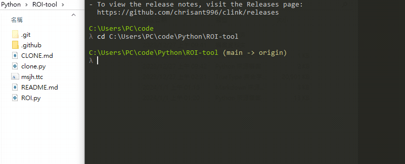

<a href='https://github.com/Junwu0615/ROI-Tool'> 
<a href='https://github.com/Junwu0615/ROI-Tool'> </br>
[](https://github.com/Junwu0615/ROI-Tool) 
[](https://www.python.org/) </br>
[](https://pypi.org/project/pandas/) 
[](https://pypi.org/project/matplotlib/) 
[](https://pypi.org/project/argumentparser/) 

## STEP.1　CLONE
```python
git clone git@github.com:Junwu0615/ROI-Tool.git
```

## STEP.2　INSTALL PACKAGES
```python
pip install -r requirements.txt
```

## STEP.3　RUN 
```python
python ROI.py -h
```

## STEP.4　HELP
- -h　Help:　Show this help message and exit.
- -w　Work Year:　您預計想要工作多少年 ?
- -y　Year:　您今年幾歲 ?
- -d　Dead:　您想活到幾歲 ?
- -e　Money Month:　您每月能投入股市資金 ?
- -r　ROI:　投資報酬率 ?
- -o　Object Number:　您預期想要達成金額 ?
- -m　Money Once:　您是否有一次性金額，若有則 `填數字`，反之則 `填0` 。


## STEP.5　EXAMPLE
`-w` 預計想要工作30年　|　`-y` 今年26歲　|　`-d` 活到90歲　|　<br/>
`-e` 每月能投入10K資金 |　`-r` ROI : 15%　|　`-o` 預期想達成3E　|　`-m` 一次性金額有300K
```python
python ROI.py -w 30 -y 26 -d 90 -e 10000 -r 15 -o 300000000 -m 300000
```

- 執行完畢後會在 `/results/` 生成 `3` 個輸出檔。
  - ROI_result.txt
  - 工作年-每年定存再投入之總資金成長走勢.png
  - 
  - 退休年-每年退休後之被動收入&提領出來之成長走勢.png
  - 
