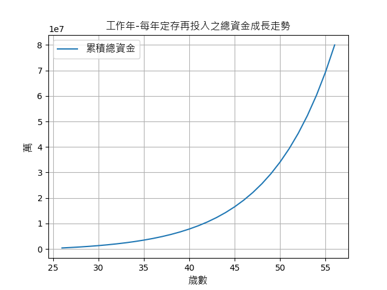
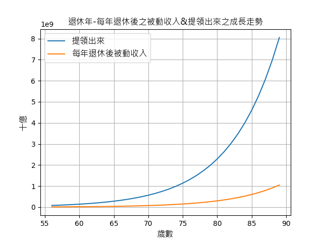

[](https://www.python.org/) </br>
[](https://pypi.org/project/pandas/) 
[](https://pypi.org/project/matplotlib/) 
[](https://pypi.org/project/argumentparser/) 

## STEP.1　CLONE

```code
git clone git@github.com:Junwu0615/ROI-tool.git
```

## STEP.2　RUN 

```
python ROI.py -h
```
#若遇到以下問題:
> ModuleNotFoundError: No module named 'pandas'.<br/>
  - `pip install pandas`<br/>
> ModuleNotFoundError: No module named 'matplotlib'.<br/>
  - `pip install matplotlib`<br/>


## STEP.3　HELP
- -h　Help:　Show this help message and exit.
- -w　Work Year:　您預計想要工作多少年 ?
- -y　Year:　您今年幾歲 ?
- -d　Dead:　您想活到幾歲 ?
- -e　Money Month:　您每月能投入股市資金 ?
- -r　ROI:　投資報酬率 
- -o　Object Number:　您預期想要達成金額 ?
- -m　Money Once:　您是否有一次性金額，若有則`填數字`，反之則 `填0`


## STEP.4　EXAMPLE
`-w`預計想要工作30年　|　`-y`今年26歲　|　`-d`活到90歲　|　<br/>
`-e`每月能投入10K資金 |　`-r`ROI : 15%　|　`-o`預期想達成3E　|　`-m`一次性金額有300K
```
python ROI.py -w 30 -y 26 -d 90 -e 10000 -r 15 -o 300000000 -m 300000
```
 - 執行完畢後會在 `/result` 生成 `3`個輸出檔。
   - ROI_result.txt
   - 工作年-每年定存再投入之總資金成長走勢.png
   - 
   - 退休年-每年退休後之被動收入&提領出來之成長走勢.png
   - 

